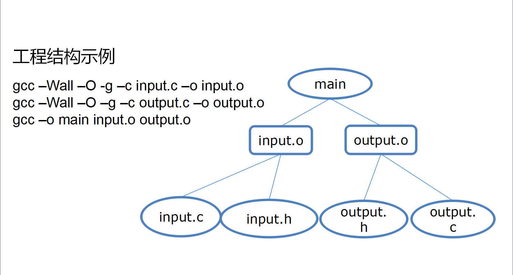
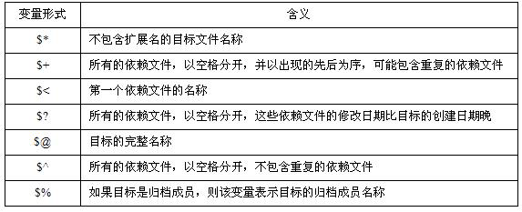

# MakefileStudy
Linux下编写makefile文件编译c程序的教程

## Makefile是什么

* Makefile 是：按照某种语法进行编写，其中说明了**如何编译各个源文件**并**连接生成可执行文件**，并**定义了源文件之间的依赖关系**的一个文件。
* Makefile 完成自动维护编译工作。
* Linux源码工程维护使用文件名Makefile。

## Makefile工作流程

1.查找当前目录下的Makefile文件  
2.初始化文件中的变量  
3.分析Makefile中的所有规则  
4.为所有的目标文件创建依赖关系  
5.根据依赖关系，决定哪些目标文件要重新生成  
6.执行生成命令

## Makefile书写规范

~~~makefile
目标文件：依赖文件列表
<Tab>命令列表
//命令前需有一个`Tab`
~~~

`目标文件(target)`即为最终的可执行文件`test`(可自定义名称)  
中间目标文件test1.o test2.o  
每个目标文件和它的依赖文件用：隔开  
每个.o文件都有一组依赖文件

调用make命令可输入：`make target`

如果省略`target`，make就将生成Makefile文件中定义的第一个目标

## Makefile中的变量
Linux下的Makefile文件里面可能会使用非常多的变量，远不像前面示例Makefile文件那样简单。这些变量对大小写敏感，一般使用**大写宇母**。

定义变量的语法：`VARNAME=string`

使用时，把变量用括号括起来，并在前面加上`$`符号，就可以引用变量的值：`$(VARNAME)`

Makefile中的变量分为
* 用户自定义变量
* 预定义变量
* 自动变量
* 环境变量

## Makefile中的隐含规则

一些默认的动作，称作隐含规则的内置的规则，这些规则告诉make当用户没有完整地给出某些命令的时候，应该怎样执行。

在我们使用Makefile时，有一些我们会经常使用，而且使用频率非常高的东西，比如，我们编译C/C++的源程序为中间目标文件（Unix下是[.o]文件，Windows下是[.obj]文件）。这里讲述的就是一些在Makefile中的“隐含的”，早先约定了的，不需要我们再写出来的规则。

“隐含规则”也就是一种惯例，make会按照这种“惯例”心照不喧地来运行，那怕我们的Makefile中没有书写这样的规则。例如，把[.c]文件编译成[.o]文件这一规则，你根本就不用写出来，make会自动推导出这种规则，并生成我们需要的[.o]文件。

## Makefile的编写实例

现在有一个c程序，实现输入姓名，输入hello+用户的输入

共有以下文件：input.h input.c output.h output.c main.c

Makefile的编写如下
~~~makefile
main:input.o output.o main.o
    gcc -Wall -O -g -o main main.o input.o output.o
input.o:input.c input.h
    gcc -Wall -O -g -o input.o input.c
output.o:output.c output.h
    gcc -Wall -O -g -o output.o output.c
main.o:main.c input.h output.h
    gcc -Wall -O -g -o main.o main.c
clean:
    rm -rf test *.o
~~~

## Makefile的简化

通过上面的代码我们可以发现，我们在编写Makefile文件的时候有大量重复语句，可以通过`自定义变量`、`自动变量`、`隐含规则`等方式简化

第一次优化：`自定义变量`
~~~makefile
CC=gcc
CFLAGS=-Wall -O -g
OBJ=input.o output.o main.o
main:$(OBJ)
    $(CC) $(CFLAGS) -o main main.o input.o output.o
input.o:input.c input.h
    $(CC) $(CFLAGS) -o input.o input.c
output.o:output.c output.h
    $(CC) $(CFLAGS) -o output.o output.c
main.o:main.c input.h output.h
    $(CC) $(CFLAGS) -o main.o main.c
clean:
    rm -rf test *.o
~~~

通过`自定义变量`，我们将原本冗长的语句进行缩短

第二次优化：`自动变量`

~~~makefile
CC=gcc
CFLAGS=-Wall -O -g
OBJ=input.o output.o main.o
main:$(OBJ)
    $(CC) $(CFLAGS) -o $@ $^
input.o:input.c input.h
    $(CC) $(CFLAGS) -o $@ $^
output.o:output.c output.h
    $(CC) $(CFLAGS) -o $@ $^
main.o:main.c input.h output.h
    $(CC) $(CFLAGS) -o $@ $^
clean:
    rm -rf test *.o
~~~

第三次优化：`隐含规则`

~~~makefile
CC=gcc
CFLAGS=-Wall -O -g
OBJ=input.o output.o main.o
main:$(OBJ)
    $(CC) $(CFLAGS) -o $@ $^
clean:
    rm -rf test *.o
~~~